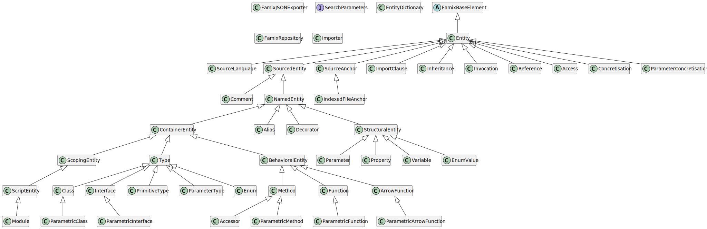

# FamixTypeScriptImporter

[](https://github.com/fuhrmanator/FamixTypeScriptImporter/actions/workflows/ci-nodejs.yml)

Create a [FamixTypeScript](https://github.com/fuhrmanator/FamixTypeScript) model in JSON of TypeScript files.

## Installation

```sh
npm install -g ts2famix
```

## npm versions

- Version 2.x.x is for Moose 11+
- Version <= 1.x.x is for Moose 10, but lacks support for several elements of TypeScript (arrow functions, full generics).

## Usage

Instructions for using the command-line importer:

```sh
ts2famix --help
```

## Parse a full project

```sh
ts2famix -i ../path/to/project/tsconfig.json -o JSONModels/projectName.json
```
or
```sh
ts2famix -i "../path/to/project/**/*.ts" -o JSONModels/projectName.json
```

## Import the JSON model into Moose

- Copy the "`JSONModels/projectName.json`" into your "`Pharo/images/[imageName]`" directory.
- In a Moose Playground, load the FamixTypeScript metamodel:
  ```smalltalk
  Metacello new 
    githubUser: 'fuhrmanator' project: 'FamixTypeScript' commitish: 'master' path: 'src';
    baseline: 'FamixTypeScript';
    load.
  ```
  Load the model into Moose:
  ```smalltalk
  'projectName.json' asFileReference readStreamDo:
    [ :stream | model := FamixTypeScriptModel new 
      importFromJSONStream: stream. model install ].
  ```
  **Note**: Windows 10/11 users can drag-and-drop the `projectName.json` model file onto the Pharo window (once the TypeScript metamodel has been loaded) for an easier way to load.

## Developer info

To run tests:

```sh
npm test
```

To build `ts2famix` locally:

```sh
npx tsc
```

To run the locally built version (not the globally installed one with npm).:

```sh
npx ts2famix [options]
```

## TypeScript Metamodel API documentation (visualization)

The following was generated by CI using [tplant](https://github.com/bafolts/tplant), in a similar fashion described [here](https://modularmoose.org/posts/2021-07-19-automatic-metamodel-documentation-generation).


